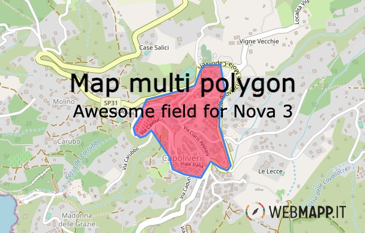

# map-multi-polygon-nova3


---

[](https://packagist.org/packages/wm/map-multi-polygon)

- [Requirements](#requirements)
- [Installation](#installation)
- [Usage](#usage)
  - [Map Multi Polygon](#map-multi-polygon)
- [Configuration](#configuration)

## Requirements

- `php: ^8`
- `laravel/nova: 3`

## Installation

You can install the package in to a Laravel app that uses [Nova](https://nova.laravel.com) via composer:

```bash
composer require wm/map-multi-polygon-nova3
```

## Usage

### Map Point


You can display a post gist geography(MultiPolygon,4326) area on the map and change it by uploading a new MultiPolygon file (.GPX, .KML, .GEOJSON)

```php
    use Wm\MapMultiPolygonNova3\MapMultiPolygonNova3;
    /**
     * Get the fields displayed by the resource.
     *
     * @param  \Laravel\Nova\Http\Requests\NovaRequest  $request
     * @return array
     */
    public function fields(NovaRequest $request)
    {
        return [
            ID::make()->sortable(),
                ...
            MapMultiPolygonNova3::make('geometry')->withMeta([
                'center' => ['42.795977075', '10.326813853'],
                'attribution' => '<a href="https://webmapp.it/">Webmapp</a> contributors',
            ]),
        ];
    }
```
## Configuration

As of v1.4.0 it's possible to use a `Tab` class instead of an array to represent your tabs.

| Property    | Type                | Default     | Description                                                                                                                                                            |
|-------------|---------------------|-------------|------------------------------------------------------------------------------------------------------------------------------------------------------------------------|
| center        | `array`            | `[0,0]`      | The coordinates used for center the view of an empty map                                                                                              |
| attribution      | `string` | `<a href="https://www.openstreetmap.org/">OpenStreetMap</a> contributors, <a href="https://creativecommons.org/licenses/by-sa/2.0/">CC-BY-SA</a>, Imagery (c) <a href="https://www.mapbox.com/">Mapbox</a>`      | the html showed as map attribution                                   |
| tiles  | `string` | `https://{s}.tile.openstreetmap.org/{z}/{x}/{y}.png`      | The tile url used.                                    |

